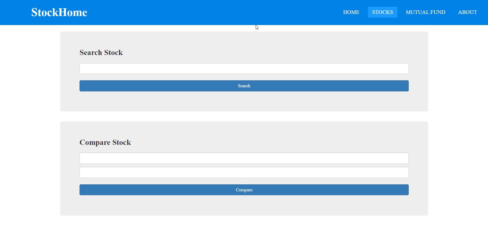
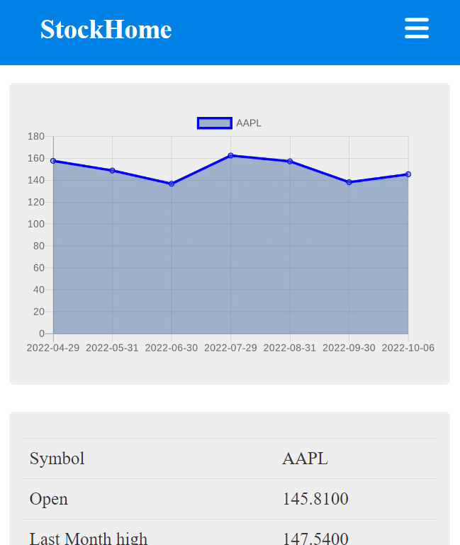
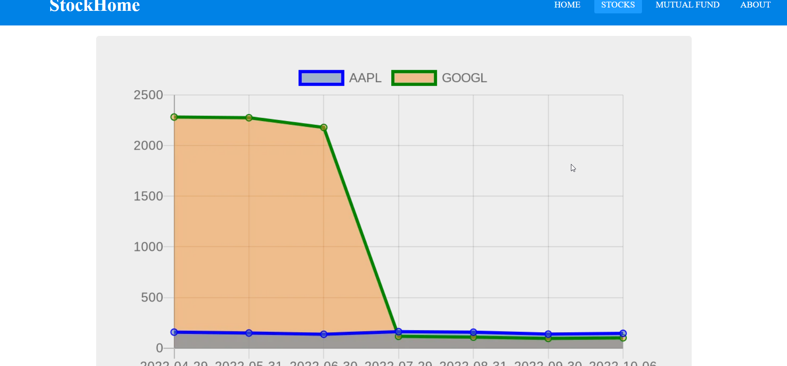
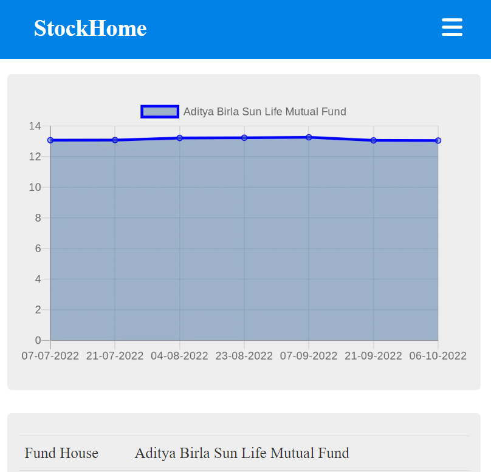

<h1>StockHome</h1>
<h2>What is Does </h2>

This project helps to search stock and mutual fund details , when a user enters the details of stock or any mutual fund it will returns the graph and other details of the query . We can also compare two stocks and mutual fund , when user compare any two stock or fund this web app will return a comparison graph .

<h2>Gallery</h2>

<h2>How to install into your local pc</h2>
<ul>
  <li>First fork this project <mark>https://github.com/samjain233/mutualFund</mark> </li>
  <li>Open the terminal and write the command <strong> git clone https://github.com/samjain233/mutualFund </strong> </li>
  <li>After cloning the project , write <strong>npm i </strong>to install the node modules </li>
  <li>Then type <strong>node index.js </strong>, after that you can view this project on<strong> http://localhost:3000/ </strong> </li>
 </ul>
<h2>Contributors</h2>
<ul>
  <li><a href="https://github.com/amansingh0811">Aman Singh</a></li>
  <li><a href="https://github.com/ishavishwakarma29">Isha Vishwakarma</a></li>
  <li><a href="https://github.com/samjain233">Sambhav Jain</a></li>
</ul>

